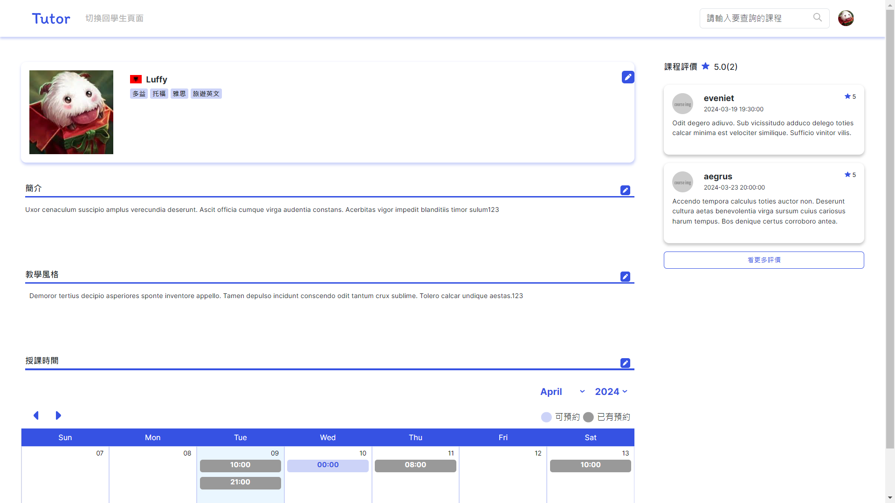
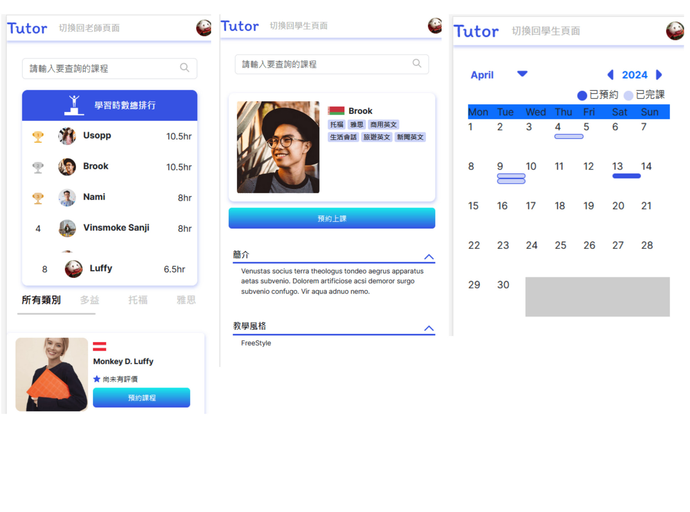

# 家教平台網站-Tutor

## 專案簡介:

- 串接後端API，並搭配 React 框架所打造出的小型專案。
- Tutor是一個提供學生和英文家教老師之間配對服務的網站，
- 您登入後即可以在此網站上預約各種分類的課程，
- 更可以進一步申請成為老師，並開設屬於自己的課程！






- Demo 網址: [http://34.125.232.84:3030/](http://34.125.232.84:3030/)
- Demo Video (電腦版) [https://youtu.be/43G4X07Lq6s](https://youtu.be/43G4X07Lq6s)   
- Back-End Link: [https://github.com/yuan6636/capstone-tutor-backend](https://github.com/yuan6636/capstone-tutor-backend)


## 功能:

根據您的不同身分，您可以在tutor網站內使用不同的功能。

### 未登入 :
- 您可以在首頁瀏覽老師的簡介，並透過分類篩選您需要的課程類別。
- 同時，您也可以使用E-mail註冊Tutor。

### Student :
- 您可以觀看教師的完整資訊，並且預約心儀的課程。
- 您可以在個人頁面看到自己預約的課程，同時，您也可以幫自己編輯簡介與大頭貼。
- Tutor將會根據你的學習時數來幫您排名，前十名的優秀學生將會展示在首頁！
- 假如您想開設自己的課程，請點選左上方的「成為老師」來填寫申請表單。

### Teacher :
- 您將擁有Student與Teacher兩種身分，請點選左上方的切換頁面按鈕來切換。
- 在Teacher模式下，您可以開設屬於自己的課程，也可以在未開課且無人預約時修改課程時間。
- 當有人預約課程時，將會在「我的課程」頁面中顯示該課程。
- 當您想預約其他人的課程時，別忘了切換回Student模式!

### Admin :
您可以在後台觀看使用者名單。

## 使用技術：

### React-Bootstrap
使用 Bootstrap 快速建立符合設計稿的網站的同時，搭配 inline style 補足 Bootstrap 不足的部分。
引入 Bootstrap 的 UI 元件，如 button、modal、form，節省開發時間。

### React-route-dom
利用 React-route-dom 達到網頁切換效果。
useNavigate, useParams 做網頁的導向，以及從網址欄抓取需要的數據。

### Axios
使用 Axios 向 API 獲取資料。

### React
使用 useState、useEffect，正確把握 React 從渲染開始到 useEffect 的執行順序。

### 其他輔助套件

1. 使用 sweetalert2 套件，有效率快速做出客製化彈出式提示視窗。
2. 使用 react-big-calendar 客製行事曆介面、
3. React-flag-select套件作為選擇國籍時方便的工具。


## 安裝與下載 :

### 下載檔案至本地資料夾
```
git clone https://github.com/enternalsong/tutor.git
```

### 開啟專案資料夾後安裝檔案
```
npm install
```

### 輸入執行碼
```
npm run dev
```

### 於瀏覽器輸入以下網址
```
http://localhost/5173/
```

## Contributer

### Front-End : @kspsss @yuri1022

### Back-End : @yuan6636 @Tommy0901

### UI/UX :


# Tutor -A website which matched English teachers and students.

## Introduction

"Tutor" is a website that provides matching services between students and English tutors. 
Once you log in, you can book various categories of courses on this website. 
And then , you can apply to become a tutor and create your own courses!


- Demo Link: [http://34.125.232.84:3030/](http://34.125.232.84:3030/)
- Demo Video (on PC) [https://youtu.be/43G4X07Lq6s](https://youtu.be/43G4X07Lq6s)
- Back-End Link: [https://github.com/yuan6636/capstone-tutor-backend](https://github.com/yuan6636/capstone-tutor-backend)

## Function

At Tutor , you can do diffrent things when you are in different identities:

### Unregistered:
You can see our teacher's brief introduction at homepage.

### Student:
You can click to see teacher's integral information , and reserve a course with your favorite teacher ! 

### Teacher:
You can create courses on Tutor website , and students will reserve your class. 
   
### Admin:
You can see member list at backstage.


## How To Use

### Download the files to your local folder:
```
git clone https://github.com/enternalsong/tutor.git
```

### After opening the project folder, install the files:
```
npm install
```

### Enter the execution code:
```
npm run dev
```

### Enter the following URL in your browser:
```
http://localhost/5173/
```

## Tools

### React
Employ useState and useEffect to effectively manage React's rendering process and the execution order of useEffect.

### React-Bootstrap
Utilize Bootstrap to quickly build websites that align with design drafts, 
while complementing Bootstrap's shortcomings with inline styles. 
Incorporate Bootstrap UI components such as buttons, modals, and forms to save development time.

### React-route-dom
Leverage React-route-dom to achieve webpage navigation effects. Use useNavigate and useParams for webpage redirection and fetching necessary data from the URL.

### Axios
Utilize Axios to fetch data from APIs.

### Other Auxiliary Libraries
Use the SweetAlert2 library to efficiently create customized pop-up alert windows.
Utilize the react-big-calendar library to create customized calendar interfaces.
Use the React-flag-select library as a convenient tool for selecting nationalities.


## Contributer

### Front-End : @kspsss @yuri1022

### Back-End : @yuan6636 @Tommy0901

### UI/UX :
